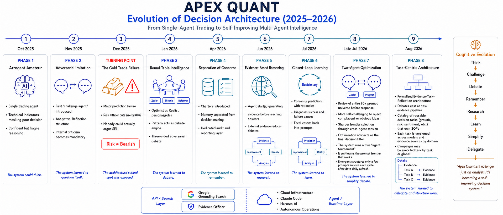

**English** | [**中文**](#中文版)

> ⚠️ **Temporary home.** My original GitHub account [`sst19910323`](https://github.com/sst19910323) was compromised and is currently suspended by the platform; an appeal to recover it is in progress. Until it's back, this project is temporarily synced here on my backup account. This repo and the original [`sst19910323/apex_parliament`](https://github.com/sst19910323/apex_parliament) are **the same project** — same content, same history, same author.

# ⚖️ Apex Quant

### Adversarial Multi-Agent Debate Framework for Quantitative Analysis

[](https://creativecommons.org/licenses/by-nc-sa/4.0/)
[](https://papers.ssrn.com/abstract=6354961)
[](https://www.python.org/)

---

Apex Quant is an LLM-based multi-agent framework for quantitative analysis. Before any decision is emitted, agents holding **opposing stances** must complete a structured debate. Most multi-agent trading frameworks split agents by **data type** (fundamentals, sentiment, technicals); Apex Quant splits them by **stance**. The framework is market-agnostic; the current implementation covers US / EU / JP / KR equities.

> **This is the v2 edition.** The debate was reshaped after a data-driven post-mortem: two advocates + an arbiter, backed by Postgres and run agent-natively. The original three-debater, file-based v1 is archived in [`README-v1.md`](README-v1.md) and frozen on the [`v1` branch](../../tree/v1).
>
> **→ Read the [Design Philosophy / 设计哲学](docs/design-philosophy.md)** (bilingual) for the whole story — including *why* v1 became v2.

> **A note on scope:** the v2 code isn't published here (yet). It's Postgres-backed, agent-native, and still moving fast — a numbered round of changes lands roughly every week, each one pushed by the previous post-mortem — so it isn't ready to be frozen and scrubbed for release. So for now this repo open-sources the **thinking** — the design philosophy and this README — while the runnable reference code is the archived **v1**.

> **Language note:** prompts, debate transcripts, and analysis output are Chinese-only for now. A dedicated translation layer that renders each final report into other languages is planned as a clean downstream step.

---

## 🏛️ Architecture: two advocates, an arbiter, evidence on call


- 🔴 **Zealot** — the bull advocate. Builds the strongest long case and never exits easily.
- 🔵 **Reaper** — the bear advocate; not a doomer but a profit-taker, asking "is this position still worth holding?"
- ⚖️ **Arbiter** — presides over the debate. It holds **no stance of its own**, but it isn't a passive referee either. It stamps evidence (`verified` / `unverified` / `not-found`), keeps the **ledger** (every concession is a priced settlement, tallied by script each round), sets the **agenda** (each round it names the open issue both sides must engage), controls the floor, and writes the final report. Its ruling has to follow the ledger — *whoever has the case gets the lean* — and a mid-band verdict is legal only for a genuine stalemate. It is forbidden to mediate or float compromises; that was the old Fulcrum's job, and it's gone. It also absorbed the old **Chronicler**'s archivist role.
- 🔭 **Scout & Runner** — the neutral evidence corps, spawned on demand, one per question. A **Scout** runs a single evidence leg: a **data** leg via IBKR (seven modes — peer comparison against a stock's *real* peers, relative strength, bars, economic series, event calendar…) or a **web-search** leg (tracing the cause-and-effect of a news item). A **Runner** executes a whole **task** along a fixed playbook (next section). Findings are shown to both sides, and may well cut against whoever asked. These roles run on a cheaper model tier than the three judging roles; the engine is never allowed to swap tiers on its own.

**What changed from v1.** The **Fulcrum** damper — a neutral third pole — was retired. An n=56 post-mortem measured it as net neutral-to-negative: it destroyed value as often as it saved, and even its "saves" tended to land below the pass line (a dead-HOLD, opportunity-missing pattern). Its one useful function, rebuttal, was internalized into the two advocates; the Bayesian concession rule was re-gated so only *verified* evidence can force a step back; and a **directed-evidence** inlet was added so debate rounds inject new information instead of merely compressing toward the mean. The full reasoning — and the data — is in the [design philosophy](docs/design-philosophy.md).

**And what has kept changing since.** Every numbered round after that has been an argument with the post-mortem data, and three threads run through all of them. **Balance** — no side and no strategy gets a free ride: buy-side and sell-side rules are written in pairs; a HOLD pays the same evidentiary toll as a trade; a "wait for confirmation" stance costs as much to declare as a position does. **Softer, fuller logic** — the crude "unconfirmed = invalid" gate gave way to graded rules: a slow grind upward is *evidence*, not noise; confirmation is a noise filter, not a default posture; a threshold is an anchor with a stated origin, not a switch. And **mantra vs. move** — the constitution keeps only the principles, while the concrete techniques live in ten short playbooks that spell out *why* each rule exists and *where* its reference numbers come from.

---

## 🎫 Beyond a lookup: when a debater files a task


A debater no longer fights solo. When a point needs more than a quick lookup — modeling a tariff shock through to CPI, reading a stock against its true peers, tracing a news item's cause and effect — it **files a task**: a work order that a neutral **runner** executes along a fixed playbook (an SOP pipeline) and hands back as a structured, high-value result. The **Scout** was the first such teammate; the playbook-runners are the rest.

Two things make this more than delegation. **Evidence is demoted to a task's output** — the first-class unit is the task (one question, one answer), and the final verdict is the composite price of all those small settlements. And **strength is the execution result, not the volume of assertion**: shout a move's name with nothing run behind it and it's priced as bare rhetoric; only a *verified* task earns a top-tier card, cited by task ID and machine-reconciled against the task ledger. Not everything becomes a task, though — a single search or one data leg stays *direct* evidence, no ticket. A task always hangs off an **issue** — the priced claim it is meant to settle — and a *verified* result pins that one claim; it doesn't close the issue by itself. Each debate carries a task budget, trimmed by expected value.

The **playbooks** are ten short SOPs — event pricing, crowding, flow attribution, magnitude-before-sign, price-action, execution lines, trend structure, size tiers, peer comparison, linked counterparties. Each one is numbered steps plus a read-off table, and every threshold in it comes with the *reason* it exists and the *origin* of the number — so it's a reference the runner can argue with, not a switch that fires. (The full story is in the [design philosophy](docs/design-philosophy.md).)

---

## 🔄 The debate flow


1. **Data prep** — market data, news, macro, plus pre-hydrated peer & economic evidence, assembled into one shared snapshot. A machine-computed **trend context** (slope, fit, counter-moves, days held above key levels) raises **beacons** naming the rules the debaters must address — the machine decides *when*, the model decides *what it means*.
2. **Opening positions** — Zealot and Reaper each form an independent judgment, with no communication, and **stake 2–4 numbered pillars**, each priced in action points.
3. **Debate rounds** — multi-round argument under the constitution, run as a **priced ledger**. A challenge must name the opposing pillar it attacks; a settlement moves the score by *exactly the price staked beforehand*, back when the outcome was unknown — nobody gets to decide how much to concede after the fact. Each round a script tallies the ledger and the Arbiter names the issue both sides must engage next. Fresh evidence — a Scout leg or a Runner task — is stamped `verified` / `unverified` / `not-found` and shared. **Concession is gated on *verified* evidence** — an unfalsifiable "there's risk" no longer extorts a step back — and pure interpretation with nothing new behind it is capped at a low tier.
4. **Verdict** — a **two-pass ruling**. The Arbiter first rules *provisionally* from what was settled on the floor, reviewing every verified, executable claim as adopted or rejected with a reason (rejecting a verified claim that carries a price needs a stated reason); only then does it audit that ruling against the ledger's arithmetic, logging every adjustment. The report carries a 0–100 **confidence dial** (0 = extreme bearish, 50 = neutral, 100 = extreme bullish — *not* a buy/sell instruction), the actual execution (BUY / HOLD / SELL + sizing + entry/stop), a **mentality** with its situational basis (a "wait" is legal only for a *pending* change — with a date or a price, and an answer to "what if it never comes"), a **conviction budget** drawn from the pillars actually won, a priced list of **known flaws**, and a decoupled **short-term** view stated as a *liquidatable claim* — a target with an invalidation level, or a range with two edges. **HOLD is an operation, not an exemption**: it pays the same toll. Both advocates attach their dissent.
5. **Factory gate.** A validator checks the report before it's written to Postgres — format, ledger arithmetic, required fields. It fails a report only for structural defects; *behavioural* smells (an early stalemate, an unanswered challenge, a verdict hugging the midpoint of a wide spread) are logged as **forensics** for the post-mortem and never used to intervene in a running debate.
6. **Postcheck.** Days later, each call is scored against real prices (**0 = whiff / 50 = miss / 100 = hit**) on 3-, 20- and 50-day windows, with hit-line events, drawdown and crossings recorded — feeding the **BP** self-improvement loop described next.

---

## 🧠 A system trained by its own hindsight (BP)

Producing a good call is half the framework. The other half — the part that makes it *improve* — is the **BP loop**, and it's a pillar in its own right.

Here's why it has to exist. Early on, the system's mistakes were the naive kind — chasing pumps, dumping on dips — and **I could spot them by eye**. As it got better, the errors turned subtle enough that only the **strongest models of the day (Claude, Gemini) could catch them**. Then it crossed a line: **no model can reliably tell, *in advance*, whether a given call is insight or accident.** The only judge left is **ground truth** — what the market actually did afterward. And once the debate is wired to live search, you **can't backtest**: there's no way to reconstruct the web as it was N days ago. History can't be replayed; it can only be run forward and graded later.

That's the whole reason for BP. Every debate is archived; days later the **postcheck** scores each call against real prices (0 whiff / 50 miss / 100 hit) and a **reckoner** agent reviews it — given only what was knowable at the time, was this a real analytical miss, or just the odds? Across many reviews, recurring failures are abstracted into common problems, and those become edits to the constitution and the architecture.

BP = **backpropagation**: the debate is the forward pass, the postcheck is the error against the real label, the review distills it into a "gradient" (a lesson, not a number), and rewriting the rules is the weight update (the constitution, not a matrix). Retiring the Fulcrum damper and re-gating the Bayesian rule were the first big updates this loop produced — decided not on a hunch but on **n=56 of the system's own measured history** (since backfilled to n=158, the conclusion unchanged). That measurement is published as the [v1 send-off report](docs/v1-send-off.md). Every numbered round since has been produced the same way: a post-mortem report names the disease — a verdict that averages, a ledger that stops moving, a "wait for confirmation" that had become free — and the next round treats it, with its acceptance sentinels written down *before* deployment so the following report can say whether it worked.

---

## 🗄️ Data, search & runners

All state now lives in **PostgreSQL** — technicals, news, reports, economic indicators, sentiment, and postcheck. The earlier on-disk JSON / CSV outputs are gone.

| Data | How it's obtained |
|---|---|
| Prices, multi-timeframe candlesticks, peer data | **Interactive Brokers (IBKR)** — the one deterministic leg |
| Stock news | **US:** Finnhub (the init leg). **EU / JP / KR:** agent web-search on the Claude Code / GPT Codex runners |
| Macro & company fundamentals | increasingly **agent-searched** (Alpha Vantage / a PG cache remain as fallback) |
| Market sentiment (Fear & Greed / VIX) | **per region** — CNN Fear & Greed for the US, with regional equivalents for EU / JP / KR |

**One prompt, two engines.** The debate-and-postcheck logic has a single content layer — constitution, playbooks, output formats, skills — shared verbatim by a **Claude Code** runner and a **GPT Codex** runner; only a thin driver layer per harness differs. (An earlier **API version** — DeepSeek + Linkup / Gemini grounding — is retired to the museum: in practice AI still rewards raw power, and my self-built search turned out *far* worse than Claude / GPT with **native search**.) Right now the **GPT Codex version is the workhorse** (driven off a $200/month plan) and the Claude Code version is secondary. Models are tiered by role: the three judging roles (Arbiter, Zealot, Reaper) on a mid-high tier, Scouts and Runners on a small tier — and any deviation is a human's explicit call; the engine never swaps tiers on its own. It isn't only data-fetching that leans on agent search — the **core debate and postcheck themselves** run on the agents.

**Agent-native "deployment."** There's no `git clone && deploy` anymore: you **hand the repo to Claude Code or GPT Codex and let it set everything up**. Orchestration runs through agents — a **Hermes** heartbeat wakes whichever engine the config names, on schedule; batch runners fire debates in waves (regional overviews, then ETFs, then single names — parent and child debates no longer depend on each other, so they run concurrently); and the debate / postcheck skills can copy themselves from the server onto a fresh machine. Because a debate lives in files rather than in any one context window, a run that stops before delivering — but whose ledger buffer moved — is picked up by a fresh process from the last record (**relay continuation**), under a per-debate liveness watchdog. Every report is stamped with the model and harness that actually produced it. This edition leans on agents by design, which is also why it's less of a turnkey repo than v1 was.

---

## 🧭 Design philosophy

The transferable part of this project isn't the code — it's what the work *taught* me about making an LLM that *talks* finance actually *do* finance. That's written up as an evolving, bilingual retrospective:

> **→ [Design Philosophy / 设计哲学](docs/design-philosophy.md)**

---

## 📄 Paper

> **Apex Quant: A Multi-Agent Debate Framework for Quantitative Trading**
> Shuting Sun · SSRN Technical Report · March 2026
> [→ https://papers.ssrn.com/abstract=6354961](https://papers.ssrn.com/abstract=6354961)

```bibtex
@techreport{sun2026apexquant,
  title  = {Apex Quant: A Multi-Agent Debate Framework for Quantitative Trading},
  author = {Sun, Shuting},
  year   = {2026},
  url    = {https://papers.ssrn.com/abstract=6354961}
}
```

---

## 🗂️ v1 archive

The original edition — three debaters (Zealot / Reaper / **Fulcrum**) + a separate Chronicler, with everything on disk as JSON / CSV — is preserved for reference:

- [**v1 send-off**](docs/v1-send-off.md) — a data-driven farewell: the full-sample postcheck (n=158) of the three-debater parliament, and the numbers that sent it to v2
- [`README-v1.md`](README-v1.md) — the full v1 README (data schema, DAG scheduler, examples, etc.)
- [`v1` branch](../../tree/v1) — the frozen v1 codebase

---

<details>
<summary>🕰️ <b>Timeline (click to expand)</b></summary>

The cast's headcount tells the first arc — one overconfident agent → two → three → and back to two. The rest of the story is what layered on top: a **reckoner + BP loop** that trains the system on its own hindsight, the **task mode** now gradually taking shape (debate ⊃ task ⊃ evidence), and the shift off a self-built **API stack** onto **agent-native** runners (Claude Code / GPT Codex).



</details>

---

## ⚠️ Disclaimer

This project is for research and personal use only. It does not constitute investment advice.

## 📜 License

[CC BY-NC-SA 4.0](https://creativecommons.org/licenses/by-nc-sa/4.0/) — Non-commercial, attribution, share-alike.

Questions and discussion welcome: **sst19910323@gmail.com**

---

<a id="中文版"></a>

> ⚠️ **临时住所。** 我的原 GitHub 账号 [`sst19910323`](https://github.com/sst19910323) 被盗后暂被平台冻结，申诉找回中。在要回来之前，本项目临时在这个小号同步更新。本仓库与原仓库 [`sst19910323/apex_parliament`](https://github.com/sst19910323/apex_parliament) 是**同一个项目**——内容、历史、作者都相同。

# ⚖️ Apex Quant — 中文

### 基于对抗性多智能体辩论的量化分析框架

---

Apex Quant 是一个基于大语言模型的多智能体量化分析框架。在给出任何决策之前，持**对立立场**的 agent 必须先完成一场结构化辩论。多数多智能体交易框架按**数据类型**分工（基本面、情绪、技术面），而 Apex Quant 按**立场**分工。框架本身与市场无关，当前实现覆盖美股 / 欧股 / 日股 / 韩股。

> **这是 v2 版。** 辩论结构经过一次数据驱动的复盘后被重塑：二元辩手 + 一位仲裁者，底层转 Postgres，以 agent 原生方式运行。最初那套三辩手、基于文件的 v1 已存档在 [`README-v1.md`](README-v1.md)，并冻结在 [`v1` 分支](../../tree/v1)。
>
> **→ 完整来龙去脉（包括*为什么*从 v1 走到 v2）见 [设计哲学 / Design Philosophy](docs/design-philosophy.md)**（中英双语）。

> **关于范围：** v2 的代码暂未在此公开。它已转 Postgres、agent 原生，而且还在快跑——差不多每周落地一轮编号大改，每轮都是上一册复盘推出来的——还没到能冻结、脱敏、打包发布的时候。所以这个仓库眼下开源的是**思路**——设计哲学和这份 README——而可运行的参考代码，是存档的 **v1**。

> **语言说明：** prompt、辩论记录与分析输出目前仅中文。计划在下游单设一层翻译，把每份终报干净地渲染成其他语言。

---

## 🏛️ 架构：两位辩手、一位仲裁者、按需取证


- 🔴 **Zealot** —— 多头辩手，构建最强的做多理由，不轻易离场。
- 🔵 **Reaper** —— 空头辩手；不是唱衰者，而是止盈者，只问"这仓还值不值得留"。
- ⚖️ **Arbiter（仲裁者）** —— 主持辩论。它**没有自己的立场**，但也不是个被动的裁判。它给证据盖章（`verified` / `unverified` / `not-found`），管**账本**（每次退让都是一笔事先标价的结算，每轮由脚本机械算账），定**议程**（每轮点名一个未结议题，逼两边在同一张牌上对撞），控场，并写终报。它的终裁必须跟着账本走 —— *谁有理向着谁* —— 只有真僵持才允许落中间带。它被明令**禁止调停**、禁止提折中方案：那是当年 Fulcrum 的活，已经没了。它还接管了原来 **史官（Chronicler）** 的存档职能。
- 🔭 **Scout（取证员）与 Runner（执行员）** —— 中立取证队，按需派出、一问一员。**Scout** 跑单条证据腿：经 IBKR 的**数据腿**（七种模式 —— 跟这只票*真正的*同行做横向对比、相对强弱、K 线、经济序列、事件日历……）或**联网搜索腿**（理清一条新闻的前因后果）；**Runner** 照一本固定 playbook 跑完一整张 **task**（见下节）。取证结果对两边公开，而且完全可能不利于发单的那一方。这两个角色跑在比裁判三角色更便宜的模型档位上，引擎不允许自己换档。

**相比 v1 变了什么。** 当阻尼器的中立第三极 **Fulcrum** 被退役了。一次 n=56 的复盘量出它净贡献中性偏负：毁值和拦截一样多，连"拦对"的也多半够不上及格线（一种"死 HOLD、白错过机会"的形态）。它唯一有用的"反驳"职能被拆进两位辩手内化；贝叶斯退让规则被重新设门槛，只有 *verified* 证据才能逼退让；再加一个**定向取证**的信息入口，让每轮辩论真的注入新信息、而非只朝均值压缩。完整推理与数据见[设计哲学](docs/design-philosophy.md)。

**之后还在变什么。** 那以后每一轮编号大改，都是跟复盘数据的一次对账，贯穿其中的是三条线。**均衡化** —— 不让任何一方、任何一种策略占便宜：买侧的规则必配卖侧的版本；HOLD 要交和交易一样的举证过路费；"等确认"这个心态申报起来要和持仓一样有代价。**柔性化** —— "没确认就无效"那种粗暴闸门换成了分档的完备逻辑：阴涨是*有证据的行情*，不是噪音；确认是防噪音的闸，不是万能默认姿态；阈值是带来历的锚，不是开关。**心法与招式** —— 宪法只留原则，具体打法住进十本短 playbook，每一条都写清*为什么*这样做、参考的数字*从哪来*。

---

## 🎫 不止于查一下：辩手可以发一张 task


辩手不再单打独斗。一个点需要的不止是随手查一下时——把关税冲击推演到 CPI、拿一只票跟它真正的同行比、理清一条新闻的前因后果——它会**发一张 task 单**：一张工作单，由中立的**执行员（runner）**照一本固定的 playbook（一条 SOP 流水线）执行，再作为结构化的高价值结果交回。**Scout** 是这样的第一个队友，playbook 执行员是其余的。

有两点让它不只是"分工"。**证据被降级为 task 的产出**——一等单位是 task（一个问题、一个答案），而终裁是所有这些小结算的综合定价。以及**强度看执行结果，不看嗓门**：喊出招式名、背后什么都没跑，就按裸修辞定价；只有 *verified* 的 task 才配最高档的牌，须引 task ID、并由机器与 task 台账对账。但不是什么都变成 task——单次搜索、单条数据腿仍是*直属*证据，不开单子。一张 task 永远挂在一个**议题**下 —— 它要结算的那张有价的牌；*verified* 的结果钉死的是那一条主张，并不自动结案整个议题。每场有 task 预算，按期望收益砍。

那十本 **playbook** 是十份短 SOP —— 事件定价、拥挤度、资金流归因、幅度先于符号、价格动作、执行线、趋势结构、大小票分层、同业横向、联动对手盘。每本都是编号步骤加判读表，里面每个阈值都附着它存在的*理由*和数字的*来历* —— 所以它是执行员可以据理力争的参照系，不是一碰就触发的开关。（完整来龙去脉见[设计哲学](docs/design-philosophy.md)。）

---

## 🔄 辩论流程


1. **备餐（Data Prep）** —— 行情、新闻、宏观，外加预先水合的同业与经济证据，汇成一份共享快照。机器另算一份**趋势结构**（斜率、拟合度、逆向回撤、站稳关键位的天数），由它点亮**引信**、点名辩手必须处置的条款 —— 机器判"何时"，模型判"何意"。
2. **开局立场** —— Zealot 与 Reaper 各自独立判断，互不通气，并各**立 2–4 根编号支柱**，每根以 action 分标价。
3. **多轮辩论** —— 在宪法约束下多轮交锋，跑的是一本**挂牌定价的账**。应战必须点名攻击对方的哪根支柱；结算的幅度 = *输赢未知时事先挂的价* —— 没人能事后再"看着给"退让分数。每轮脚本机械算账公示，仲裁者点名下一轮两边必须对撞的议题。新证据 —— Scout 的一条腿或 Runner 的一张 task —— 盖 `verified` / `unverified` / `not-found` 并三方共享。**退让以 *verified* 证据为门槛** —— 一个不可证伪的"有风险"再也讹不到退让；没有新证据的纯解读，牌价封顶在低档。
4. **裁决** —— **两遍终裁**。仲裁者先只凭场上结算立 *provisional*：把每条 verified 且可执行的主张逐条判采纳 / 驳回并给理由（驳回一条带价位的 verified 主张，必须说出为什么不该执行）；然后才拿账本算术审计这份初判，每处改动留痕。终报带一个 0–100 的**信心刻度**（0 极空、50 中性、100 极多 —— *不是*买卖指令）、实际执行（BUY / HOLD / SELL + 仓位 + 入场/止损）、一个带情境依据的**心态**（"等待"只对*未决*的变化合法 —— 要有日期或价位，还要答得出"等不来怎么办"）、从真正赢下的支柱里领取的**信念额度**、一份标了价的**已知瑕疵**清单，以及一个解耦的**短线**视图 —— 写成*可清算的价位主张*：一个目标配一条失效线，或者一个带两沿的区间。**HOLD 是操作，不是豁免**：交一样的过路费。两位辩手各自附上异议。
5. **出厂机检。** 写入 Postgres 之前先过一道校验 —— 格式、账本算术、必填字段。它只因结构性缺陷拒出厂；*行为类*的可疑（过早僵持、挑战无人应答、宽价差下终裁贴中点）只记进 **forensics** 留给复盘用，永远不拿来干预进行中的辩论。
6. **后验（Postcheck）。** 若干天后用真实价格给每次判断打分（**0 踩空 / 50 错过 / 100 踩中**），分 3 / 20 / 50 个交易日三档窗口，撞线事件、回撤深度、穿越次数一并记录 —— 喂给下面要讲的 **BP** 自我改进闭环。

---

## 🧠 一套被自己"事后诸葛"训练的系统（BP）

给出一个好判断只是这框架的一半。另一半 —— 让它**自我改进**的那一半 —— 是 **BP 闭环**，它本身就是一根支柱。

为什么非有它不可：早期系统犯的是幼稚错误 —— 追涨杀跌 —— **我肉眼就能看出来**。它变强之后，错误越来越微妙，只有**当时最强的模型（Claude、Gemini）才抓得住**。再往后就越过一条线：**没有任何模型能*事先*可靠地分辨，一次判断到底是洞见还是事故。** 唯一还能当裁判的，是 **ground truth** —— 事后市场真正怎么走。更何况，一旦辩论接了实时搜索，就**没法回测**了：你无法还原 N 天前那一刻的网络。历史重放不了，只能正向跑一遍、事后再打分。

这就是 BP 的全部理由。每场辩论都落盘；若干天后**后验**用真实价格给每次判断打分（0 踩空 / 50 错过 / 100 踩中），再由 **reckoner（清算者）**复盘 —— 就当时能知道的信息，这是真正的分析失误，还是本就属于赔率？反复出现的失误被抽象成共性问题，再变成对宪法与架构的修改。

BP = **反向传播**：辩论是前向推理，后验是对真实标签算误差，复盘把它提炼成"梯度"（一条教训，不是数字），改规则就是更新权重（那部宪法，不是矩阵）。退役 Fulcrum、给贝叶斯重设门槛，就是这个闭环跑出的头两个大更新 —— 不靠拍脑袋，靠系统自己 **n=56** 的实测历史（后来补跑扩到 n=158，结论不变）。那次实测已作为 [v1 送别报告](docs/v1-send-off.md) 公开。之后每一轮编号大改都是同一条路生出来的：一册复盘点出病灶 —— 终裁在算平均、账本不动了、"等确认"变成了免费心态 —— 下一轮对因下刀，并且在部署*之前*先把验收哨兵写下来，好让再下一册复盘能说出这刀到底有没有用。

---

## 🗄️ 数据、搜索与运行版本

所有状态现已存入 **PostgreSQL** —— 技术指标、新闻、报告、经济指标、情绪、后验。此前的 JSON / CSV 文件输出已取消。

| 数据 | 怎么取 |
|---|---|
| 行情、多时间尺度 K 线、同业数据 | **盈透（IBKR）** —— 唯一确定性的一条腿 |
| 个股新闻 | **美股：** Finnhub（init 腿）。**欧 / 日 / 韩：** Claude Code / GPT Codex runner 的 agent 联网搜索 |
| 宏观与公司基本面 | 越来越靠 **agent 搜索**（Alpha Vantage / PG 缓存留作兜底） |
| 市场情绪（Fear & Greed / VIX） | **分区** —— 美股用 CNN Fear & Greed，欧 / 日 / 韩各有对应的区域指标 |

**一套 prompt，两个引擎。** "辩论 + 后验"的逻辑只有一层内容 —— 宪法、playbook、输出格式、skill —— 由 **Claude Code** runner 和 **GPT Codex** runner 逐字共用，两边只差一层薄薄的驱动壳。（早先的 **API 版** —— agent 用 DeepSeek、搜索用 Linkup 或 Gemini grounding —— 已退役进博物馆：实践下来 AI 到底还是讲究"力大砖飞"，我自己搭的搜索比 Claude / GPT 的**原生搜索**差很多。）眼下 **GPT Codex 版是主力**（用一个 200 刀/月的套餐驱动），Claude Code 版次之。模型按角色分档：裁判三角色（仲裁者、Zealot、Reaper）用中高档，Scout 与 Runner 用小模型 —— 任何偏离都要人明确特批，引擎永不自主换档。而且不只是取数靠 agent 搜索，**核心的辩论与后验本身也跑在 agent 上**。

**agent 原生的"部署"。** 不再是 `git clone && 部署`：而是**把仓库交给 Claude Code 或 GPT Codex，让它自己把一切装好**。编排交给 agent —— 一个 **Hermes** 心跳按点唤醒配置里指定的那个引擎；批处理 runner 分波次开火（先各区域大盘、再 ETF、再个股 —— 父子场之间不再有依赖，可以并发）；辩论 / 后验的 skill 还能从服务器自拷到一台新机器。因为一场辩论住在文件里、而不在某一个上下文窗口里，一棒没跑完就停、但账本 buffer 有前进的场次，会由新进程从最后一条记录接着跑（**接力续跑**），外面还有逐场的活性看门狗。每份终报都盖着真正产出它的模型与 harness 的签章。这一版从设计上就重度依赖 agent，这也是它不像 v1 那样开箱即用的原因。

---

## 🧭 设计哲学

这个项目真正可迁移的不是代码，而是这一路让我明白的一件事：**怎么让一个会"说"金融的 LLM，真正"会做"金融。** 这些写成了一份持续演进、中英双语的回顾：

> **→ [设计哲学 / Design Philosophy](docs/design-philosophy.md)**

---

## 📄 论文

> **Apex Quant: A Multi-Agent Debate Framework for Quantitative Trading**
> Shuting Sun · SSRN 技术报告 · 2026 年 3 月
> [→ https://papers.ssrn.com/abstract=6354961](https://papers.ssrn.com/abstract=6354961)

---

## 🗂️ v1 存档

最初那一版 —— 三辩手（Zealot / Reaper / **Fulcrum**）+ 独立史官，一切以 JSON / CSV 落盘 —— 已保留备查：

- [**v1 送别**](docs/v1-send-off.md) —— 一次数据驱动的谢幕：三辩手议会的全样本后验（n=158），以及把它送往 v2 的那些数字
- [`README-v1.md`](README-v1.md) —— 完整的 v1 README（数据 schema、DAG 调度、示例等）
- [`v1` 分支](../../tree/v1) —— 冻结的 v1 代码

---

<details>
<summary>🕰️ <b>开发时间线（点击展开）</b></summary>

阵容的人数是故事的前半段——一个过度自信的单 agent → 两个 → 三个 → 又收回两个。后半段是层层叠上去的东西：一个让系统用自己"事后诸葛"训练自己的 **reckoner + BP 闭环**、如今逐渐成形的 **task 模式**（辩论 ⊃ task ⊃ evidence），以及从自搭的 **API 版**转向 **agent 原生**运行版（Claude Code / GPT Codex）。


</details>

---

## ⚠️ 免责声明

本项目仅供研究与个人使用，不构成任何投资建议。

## 📜 许可证

[CC BY-NC-SA 4.0](https://creativecommons.org/licenses/by-nc-sa/4.0/) —— 非商业使用，署名，相同方式共享。

欢迎来信探讨：**sst19910323@gmail.com**
