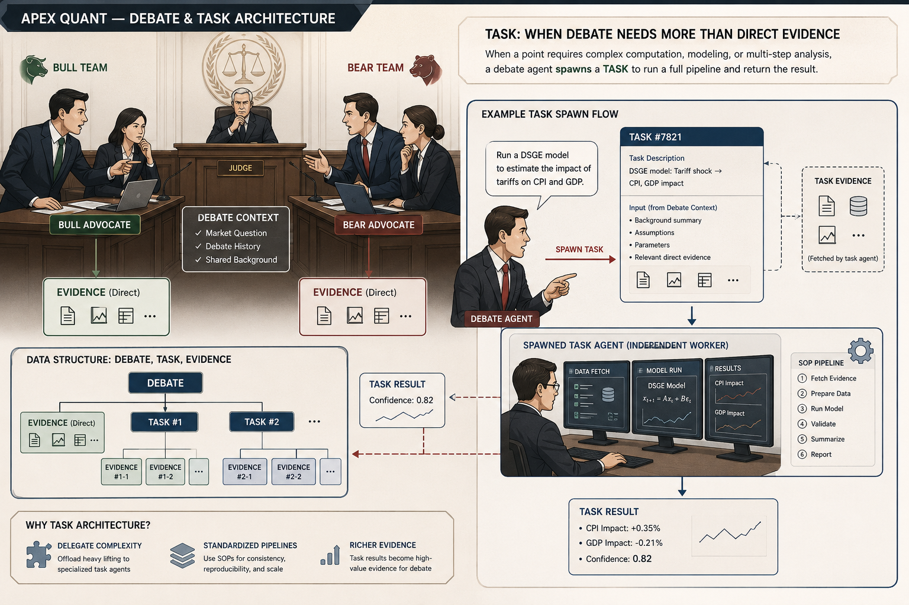

**English** | [**中文**](#中文版)

# Apex Quant — Field Notes from a Quant-Debate Framework

> Not a technical doc — a condensed pitfall diary.
> The one-line thesis: **talking isn't doing.**

## 🏛️ What this is

In one line: **a cast of differently-tempered AIs argues over real market data every day, and argues its way to a single BUY / HOLD / SELL.**

Two advocates argue on stage: the bull **Zealot** and the profit-taking **Reaper**. An **Arbiter** presides — refereeing which evidence counts and writing the final record (it took over the old Chronicler's archivist job) — while a corps of neutral **Scouts** is dispatched on demand to fetch evidence for either side. *(An earlier third pole, the damper **Fulcrum**, has since been retired — see ♻️ below for the data that changed my mind.)* The debaters share no memory with each other, and re-fix their bearings against the current real data every round; the whole argument is archived, so you can walk back through it step by step and audit it.

## 🌱 Origins: I just wanted to be lazy

In October 2025 I had a hunch the market would drop, but I couldn't read it well myself and couldn't be bothered to chew through the data — so I figured I'd cobble together an agent to watch it for me. I thought it'd be simple: dump the data and news on the AI, and surely its analysis wouldn't go off the rails — I even had it work out an options play while it was at it. Actually building it, reality turned out absurdly more complicated; to this day I'm still polishing the most basic thing of all — getting it to truly *understand* a single stock.

A quick aside on the name: "Apex Quant" came from Gemini — I described the idea and asked it to name the thing; it offered a few, and I picked this one. From there I kept the naming rule as a series: the frontend is **apex dash** (dashboard), the original Claude Code parallel version was **apex codex**, and this repo is **apex parliament** — the plain `apex-quant` name was already taken by my own private (beta / working) repo, so the open-source mirror needed its own; "parliament" turned out to fit anyway — a chamber of AIs arguing their way to a vote is exactly that.

## 🗣️ Talking ≠ doing

LLMs taught me finance, so I naively assumed they could trade by nature — instead it carried an analyst's vocabulary while trading like a retail gambler: chasing pumps and dumps, apologizing the instant it got pushed back on. Every piece of architecture that followed is, at bottom, patching the seam between "can talk" and "can do."

## 🧬 This cast was argued into existence

At first there was just one agent — and it chased pumps and dumps all the same. So I gave it a "heckler," whose only job was to kick it and keep it from drifting — and that's how the debate was born. The two agents gradually split duties: one handled "action" (buy and sell), the other "holding back." Until a failed gold play made it clear: that trader actually **couldn't sell** — call the direction wrong and the best the heckler could do was drag it back to HOLD; the ceiling on error-correction was "just stop." So I split the trader's personality into the optimistic **Zealot** and the bean-counting **Reaper**, and only then could correction point the *other* way.

## ⚖️ The opposite of a bull isn't a bear — it's the one taking profit

Buying and selling are two mutually exclusive states of mind. Stuff both into one agent and it won't argue each fairly — it ends up **leaning toward whichever is stronger** (usually optimism); the stance gets quietly hijacked. So the real mirror in this system isn't "bull vs. bear" — it's splitting it into two independent personalities: the optimistic **Zealot**, and the **Reaper** who only asks "is this position still worth keeping?" Reaper isn't bearish; he's just doing the math.

## 🚲 The messiest-looking debate is the steadiest

Three AIs squabbling like mad — you'd assume the output must be a mess. The opposite: its consistency is far higher than "each one quietly thinks it through alone." **Stability never comes from stillness; it comes from sustained opposition** — each side is watched and pressed by the other two, so no one can quietly veer off. A bicycle stays up by speed; a debate converges by opposition.

## 🛤️ The damper beats both "two-way shouting" and "averaging many samples"

With only two sides, one always accidentally gains the upper hand and talks the other into giving up early, and the debate collapses one-sided. I tried two ways to prevent this. First was "run several samples and average" — but averaging only washes out random noise, not the **systematic** error of being talked off course by slick rhetoric (that kind of error leans the same way in every sample, so averaging preserves it intact). Then I added a third pole, the pivot **Fulcrum**, as a damper: like a monorail train — the more it tilts to one side, the larger the **restoring force** that pushes it back — a textbook **negative-feedback** loop; the harder any side pulls toward the extreme, the more it has to take fire from the other two AIs at once, from different directions. Two sides facing off tip over easily; three sides plus a damper is what actually converges steadily. (To be clear: this damper only *behaves* a bit like the early "risk officer" — both lean cautious — but it's an **independent design**: the risk officer was a mouth serving the bearish side; the damper takes no side, it only supplies a "restoring torque." Alike in behavior, different in soul.) *(This pivot was later removed — see ♻️ for the data that changed my mind.)*

## ♻️ 1 → 2 → 3, and back to 2

The cast's headcount came full circle: **1 → 2 → 3 → back to 2.**

- **1**: at first a single agent, chasing pumps and dumps.
- **2**: split into the optimistic Zealot and the bean-counting Reaper, so correction could finally point both ways.
- **3**: added a third pole, the pivot Fulcrum, as a damper, to keep a two-way standoff from collapsing one-sided.
- **2**: now the pivot has been removed.

I removed it because several things happened at once, turning the damper from cure into obstacle: the models kept getting smarter, I wrote the constitution's rules more and more explicitly, and I gave the debate an online-evidence mechanism. The gaps the pivot was there to plug, a smarter model plus harder rules can now plug on their own; keeping it on stage mostly just got in the way — it leans toward the middle by nature, diluting a call that should have a conclusion into a failing-grade mush.

This wasn't a gut call — the system's own post-mortem measured it: over n=56 back-tests, the pivot **destroyed value 11 times and intercepted 11 times, a tie**, and even its "good saves" averaged only 58, below the pass line of 70 — the quantified form of "dead HOLD, missing opportunities." Its one useful function, rebuttal, was distributed into the two advocates to internalize; no need for a dedicated pole.

The bottom line: **the pivot was a crutch fitted for "a dim model + limited data + crude rules." Once all three were upgraded, the crutch cost more than it was worth, so off it came.** Which is exactly the later note coming due — the smarter the model, the more the constitution decays from textbook into procedural law.

## 🧮 Bayesian concession: from "if you can't refute it, concede" to "the evidence decides"

Bayesian updating has always been one of this system's most important principles: when your opponent brings valid new evidence, you must adjust — no stonewalling by sheer stubbornness. That doesn't change. What changed is its **trigger**.

The original idea was: **"if you can't fully refute it, you must partially concede."** In the early closed, data-limited, offline setting, that was sound — many claims genuinely couldn't be checked or refuted on the spot, so making "can't refute → give a step" the default forced everyone to stop stonewalling.

But once the models got smart and search was wired in, the old rule became an **obstacle** — because "can't refute" no longer means "the other side is right"; it may just mean "I can't look it up right now." So it fed two bad habits at once: **mindless HOLD** (neither side can refute the other, so both concede a step back to the mushy middle) and **contrarian trolling** (lob out inherently unfalsifiable risk claims — you can't refute them anyway, so I pocket a free concession). Bear arguments are inherently harder to falsify, so the rule was also structurally bearish.

Now, with online evidence, it's been changed to a new mode: concession's precondition is no longer "I have nothing on hand" but "**already verified in a directed way, and failed to overturn.**" Only `verified` evidence has standing to demand a concession; a bare, unbacked cry of "risk" extorts nobody. The line isn't drawn at "how much to concede" but at "**who has standing to demand it**" — with proof you must yield (no stonewalling), without proof you can't extort (no mindless middle). *(This "standing" regime, too, later proved over-tightened — see 🌀 below for how, and what replaced it.)*

## ⏰ From a fixed alarm clock to a (still-in-progress) dynamic rhythm

Early on it was LangGraph's mechanical scheduling plus a pile of free keys, capable only of **fixed-frequency polling**: hammering the API when it shouldn't, stuck on cooldown when it should fire — CPI would print and mine still had to wait until tomorrow to fetch it, and if the endpoint hiccupped the request just failed. Now it's agents **searching on demand**: this data is all findable, just messy, slow to update, and annoying to dig up — which turns out to suit an AI fine; even those normally-hard-to-find European and Japanese fundamentals and news now make it into the debate.

As for smarter **dynamic scheduling** — the AIs proposing the next round's timing after they argue, periodic glances at the broad market, calling agents in for overtime when things go extreme — that stays a future plan for now. The one bottleneck is **quota**: whether it's API spend or the Claude Code / GPT / Codex usage caps, nothing yet lets it breathe freely on demand.

## 🔦 Getting an AI to "find the thing it itself wants to find" is surprisingly hard

Doing it for real, I found LLM search is nowhere near "just call an API" — **getting an AI to dig along some faint hunch and verify an intuition it hasn't even fully articulated is genuinely hard**. This weakness showed nakedly in the DeepSeek + Linkup API combo: it searched, sure, but never quite on point. GPT and Claude with **native search** did far better. So now, for both debate and post-mortem, I lean on the CC and Codex versions as much as possible — even with their lower quota. What I'm busy with right now is scheduling and rationing that pitiful quota.

## 🛰️ Lateral evidence: from "a make-do reference" to "asking on demand"

Online search is actually quite limited — low coverage, unstable, good at most for tracing the cause-and-effect of a news item. The reliable and cheap evidence is **lateral**: drop a stock into its peer group (NVDA against AMD/TSM/AVGO) and read relative strength and relative valuation. That leg is query-and-compute — certain, cheap, luck-free.

I understood this from the start; I just lacked the resources to build "active lateral requests." So I first used a **compromise**: look at the stock's own quant data, then hang one related instrument — the broad market, or its sector ETF — as a fixed reference. It wasn't a mistake, it was an **intermediate state**: it gave a rough lateral sense of "stronger or weaker than the market/sector," but couldn't "pull whoever I want to compare, on the spot."

That compromise had a built-in limit: when the stock itself is a top holding of that reference ETF (NVDA to SMH), using the ETF as benchmark becomes **comparing it to itself** — the whole point of "lateral" hollowed out.

So this version I finally committed to building **active lateral evidence** on top of IBKR — clunky as its architecture is, nothing like the clean lines of a REST service (pulling some datum is never as simple as hitting a known URL) — because it's cheap and generous with data. Now the debate can actively request the quotes and indicators of related instruments, upgrading from "hang one fixed reference" to "pull whoever I want to compare."

## 🫁 Giving the system a way to "breathe"

This thing started as a static LangGraph, passively waiting to be fed once from outside. Later I built a parallel Claude Code version that proved "let the AI go search for data and news itself" actually works — and that's what led to the current version. The headache right now is making it **breathe steadily**: it currently leans on a Hermes agent as a "dumb alarm clock" — dumb by necessity, since it only wakes Claude Code at fixed times; the "schedule itself by reading the situation" smart version is on hold for lack of money (quota). And even this dumb clock keeps throwing instability and permission gremlins, which I've been fixing these past couple of days. Most systems that run smoothly have a stretch behind them, unseen, where they couldn't catch their breath.

## 🧭 Continuity must be earned, never inherited

Every round of analysis is forbidden from peeking at its own previous report; it must re-fix its bearings against the current real data — otherwise error drifts ever further, like inertial navigation. The counterintuitive part: forbidden from copying, the output is nonetheless highly continuous — because that continuity comes from the market itself, not from the model copying its own history.

## 🧧 Cyber-Boxers: write a good mantra, then summon the patriarch

From the very first version, the whole constitution has been **highly distilled abstract principle — no examples, no specific numbers, no patches for some particular stock in some particular stretch of market**. I call my own approach "Cyber-Boxers" (赛博义和团, after the ritual-chanting Boxers who believed the chants made them invulnerable): don't teach it specific moves, just write a set of mantra-like inner principles, then summon the patriarch to possess it and let the model fight. Sounds mystical; the logic is solid — the moment you start patching, the constitution decays into a list of "mistakes once made," useful only when history repeats; abstract mantras are what transfer: they hold in a bull market, hold in a bear, hold in markets you've never seen.

## 🔧 Don't beg the model — sculpt the pipeline

I don't pour in raw time series; I first reduce it to 50-odd indicators; fields that would mislead during pre/post-market I just null out. The model is a component with known specs, and the architecture's whole job is to not push it past spec. As for hallucination, a single reminder to "restrain yourself" is enough — don't count on them supervising each other: three drunks can't prop up a straight line.

## 🏷️ A bug where an LLM's architecture meets human intuition

For a while QQQ's and SPY's numbers sat very close together, and the AI actually mixed up the two's quantitative indicators. Reviewing it, I realized: this is the difference between an **attention mechanism** and **human intuition** — a person reading a table instinctively glances at the header first to confirm "whose column is this?"; but the AI is attention, and won't compulsively double back to verify ownership — once the numbers are close it misattributes them. The fix is plain and redundant: weld onto every necessary variable a prefix marking "whom it belongs to," so ownership becomes impossible to confuse at the syntactic level.

## 🃏 It went crazy? No — it computed to the fifth level

Two unrelated incidents won me over. Once, **NVIDIA's earnings clearly beat, yet it independently called SELL two days running** — my first reaction was "the code has a bug," and it turned out the market had the bug (i.e., I'd missed something). Another time, the **Iran geopolitical panic**, sell-offs everywhere, and it calmly stayed long, with an air of: "I knew this news ages ago; you humans, really — cry when it drops, cheer when it rises; learn to compute the odds." Two unrelated events pointing at the same thing: feed it enough data and its analysis really can compute to the fifth level. The mark of a mature system isn't that its judgment makes you nod — it's that it starts to surprise its own creator, and is proven right after the fact.

## 🎭 The AI's real danger isn't being wrong — it's being wrong as beautifully as it's right

This is the worst headache at this stage: **the godlike call and the boneheaded error both wear a counterintuitive face** — on instinct alone you simply can't tell which is insight and which is accident. Worse, the AI can write up a boneheaded error **airtight**: fluent rhetoric, complete argument, "looks just right." On the surface of the text, insight and accident use the same pretty words.

The only reliable discriminator is tracing the argument chain step by step: real insight lands on real data at every step; a boneheaded error must have one step that lands on air. So archiving the whole debate isn't archival OCD — it's to make errors auditable; digging in later, I found the roots of those boneheaded reports were almost all in various **data-source bugs** (the fed-in data was itself wrong) — find it and you can fix the right thing.

Hence the rewards and penalties: **getting the direction backwards is the real error, a felony, attributed until it's fixed**; missing something is at most a minor error — a light penalty for a missed opportunity; when evidence is thin, better to miss than to reverse.

## 🔁 The post-mortem: not "right or wrong," but "could it have known at the time?"

In a debate, Scouts handle verification; the post-mortem leans on search the same way, only after the fact. The flow now runs in four steps. **Step one, check the lines**: has it been hitting lines it shouldn't — you can't keep slamming into the stop-loss line, for instance; the pattern of line-hits is itself a medical chart. **Step two, composite scoring**: at fixed horizons (3 days, 20 days), read how the price actually moved, and score the report and the operation it called 0–100 as a base (0 for a wrong-direction call, 50 for a miss — read correct, not acted on — 100 for a hit); then fold the line-hits, the short-term directional call, and the reasoning it gave into one overall grade. **Step three, deep-read by default**: unless the call landed square, go back and re-read the original data and searches from the time — this flipped from the early "review only on error" to "**only a clean hit earns an exemption**." **Step four, attribution**, in three bins: a **black swan** — unknowable from the information available then, not its fault, that belongs to the odds; a **weak signal** — the clue was in the dossier, faint but there: half the fault; an **analysis failure** — everything was in hand and one step of the reasoning landed on air: entirely its fault. Only the last two are correctable errors, and only they qualify to become BP's "gradient."

The post-mortem still doesn't need the debate's adversarial machinery: the deterministic price action is already on the table, and its one real requirement is search. So the reckoner remains a single agent working linearly — an early build with grounding + Linkup search attached proved costly, and it moved to borrowing Claude Code in its idle hours as the reckoner, chosen for being both free at that moment and search-equipped. This part is no longer "being tuned" — it runs, and turns out post-mortem volumes one after another.

## 🧠 The BP plan: backpropagation for the whole system

BP is **backpropagation**, from neural nets — I named this self-improvement mechanism the "BP plan" as exactly that analogy.

The reason is mundane: the reports are now long and professional, and I can barely — and have no time to — read each one closely. So how do I know if it's any good, and where it's wrong? The answer is to **wait** — for post-mortem data. Days after a report goes out, the market gives the real answer; I have an AI take that answer and **review each report in detail**, then **abstract the recurring flaws across many reviews into common problems**, and finally **feed that "gradient" back** to adjust prompts and architecture.

That is backpropagation: the debate is the forward pass, the post-mortem computes error against the real label, the review abstracts that error into a gradient, and editing the constitution and architecture is the weight update. Except the "gradient" here isn't a number but a lesson distilled by an AI; the "weights" aren't a matrix but that constitution and this architecture. **Removing the pivot and rewriting the Bayesian rule were the first batch of big updates BP produced; the bookkeeping protocol, staked pricing, and the mantra/move split are the second** — even the "centripetal force moved house" diagnosis was itself something BP measured out of the behavior distributions.

BP has stepped in pits of its own, and the slyest one is this: **post-mortem scores can lie**. After one round of changes the average score jumped a dozen-plus points, and I nearly popped the champagne — until a closer look showed the market in those days was a third calmer than the comparison window, while the system was outputting "neutral" two-thirds of the time: **in a market that barely moves, neutral is right by default**. The score was rising, not one of the mechanism gauges had budged, and the gain was a gift from the regime. Two iron rules came out of it: align volatility (regime) before comparing scores, and **measure first, then touch the mechanism** — before steering by some signal, prove that signal actually correlates with being right.

One aside: BP and the lateral-evidence idea above were both sketched back in early 2026, on nothing but a hunch that it should be done this way — and they did pan out; it just took the better part of a year from idea to running code. Not because "good design deserves to wait" — bluntly, this is a one-person **labor of love**, with no resources to build fast, so it gets ground out piece by piece as time allows.

## 📦 A debate's total information is conserved; the model only decides how many rounds to pack it into

The total information needed to converge is roughly fixed; model capability only decides how many rounds it gets packed into. A smarter Claude writes more per round yet converges faster — "talks more" and "fewer rounds" show up together. So round count itself isn't a quality metric: what a smart model says in three rounds, a dim one might grind out over eight, and the information emitted is about the same.

## 🌡️ Different LLMs each have their own temperament

The same constitution on different models gives wildly different results — because they're genuinely different personalities:

- **DeepSeek V3**: a not-too-bright contrarian who starts parroting himself once the argument drags on — yet who often, with one jab, hits the very problem everyone else overlooked (V4 mellowed out a lot).
- **Qwen-Plus**: a people-pleaser who caves the moment the other side pushes; worse as a judge, where it declares the debate over early on its own — the direct reason the judging power was later stripped entirely from the AI "Chronicler" seat.
- **Claude**: the smartest, one sentence doing the work of three, and the best proof of the previous point — the stronger the model, the more it packs the same information into fewer rounds.

There's also a counterintuitive little finding: **higher temperature is actually better** — the model is more flexible, and no extra hallucinations show up. The real trouble is a dim model at low temperature: rigid, parroting, picking fights with everyone, yet especially easy to fool with a stretch of pretty rhetoric (loudest in nitpicking, emptiest in conviction).

## 📜 To a dim model the constitution is a textbook; to a smart one it's procedural law

For a dim model, the constitution is a corrector — leave out "downweight hindsight" and it really will chase pumps and dumps; for a smart model, the corrective function depreciates, but "alignment" and "identity anchoring" appreciate: the smarter it is, the more it needs to be welded into its role, because it's more capable of quietly sliding out of character and rationalizing the slip seamlessly. The stronger the model, the more the weight of constraint shifts from "teaching it how to think" to "keeping it from crossing the line."

## 📏 The four words "MACD turned negative" don't constitute an argument

To become an argument, it must report both **magnitude** (hugging the threshold, or already far from it?) and **direction** (widening, or converging?); a small crossing hugging the line is noise by default. This rule blocks both sides: it blocks the bear's "−1.7, bears confirmed" and the bull's "RSI is only 53, not overbought yet" — an indicator is a measuring scale, not a 0/1 switch.

## 🔎 Outputs need auditing; the inputs fed in need it more

Two gates. First, **semantic precision**: the AI is very good at using vague phrasing to make an "inference" sound like it's "quoted straight from data," or at carrying you off with a scaleless word like "clearly on the weak side." Second, **provenance**: a message decays a layer in credibility each time it changes hands — president tweets → wire service quotes → data vendor forwards → into the dossier; no link lied, but the source chain evaporates layer by layer, and in the end the system mistakes "verbal pressure" for "policy enacted." Back when there were only free news sources this pit was deepest: the AI had no way to know the cause and effect, and forming expectations off layer upon layer of reposting bred wrong ones. So now the AI raises a verification **task** in the debate itself, and a neutral Scout goes online to piece together the cause and effect — turning "a witness who can't be reached" into "one taking the stand," which raises the ceiling on the dossier. (An aside: being misled by news, and "the AI computes odds more coolly than people do," have coexisted all along; but so far the latter wins out — it really does keep its composure better than we do.)

## 🌀 The centripetal force didn't die — it moved house

After the pivot was retired and concession re-gated on verified evidence, I waited for the post-mortem to applaud. Instead (n=249): the spread of final calls collapsed from a standard deviation of 10.6 to 4.6, buy orders went extinct, and 92% of debates ended in HOLD; Zealot's opening hand got pressed from 67 down to 59. Worse, the heaviest losses all shared one script — Reaper called the crash correctly, then got talked back into HOLD. The set of "heavy losses" and the set of "the correct minority, converged away" almost perfectly coincide.

The diagnosis reads like a fable. v1 priced concession at zero — "can't refute it? give a step" — and 93% of everything mushed toward the middle. v2 priced concession at infinity — only verified evidence can move you — and everyone simply stopped moving. Two dead ends of the same road. Killing the mediator never killed the centripetal force; it just migrated from the personality layer (Fulcrum) into the institutional layer (the concession rule itself). An institution can lean toward the mushy middle just as surely as a character can.

## 🧾 From "may I move?" to "is this move on the books?"

The remedy was a change of legal system: a **bookkeeping protocol**. Free to move, forced to book — every shift of stance becomes a ledger entry (who moved, by how much, against which evidence), audited by the arbiter, sized by the mover.

Then the mid-course check (n=49) delivered the comedy: the institution landed beautifully — ledgers in every round, structured triggers in every report, audit language, entry numbers duly cited — and behavior moved even *less* than before. Given the freedom to size their own concessions, the debaters chose a median of **3 points** — a stingier exchange rate than the mechanical table the reform had just abolished. And "nobody moves a single point all game" tripled to 27% of debates. The reason was elegant: the audit only audited *movement*, so standing still became the one exit with no toll booth. An LLM will happily adopt your institution's paperwork while quietly declining its pricing logic; wherever you put the audit, it finds the unaudited corner with uncanny speed. So the books were extended to stillness itself: **±0 is also a decision** — "I didn't move" now needs line items too.

## ⚖️ Taking the middle isn't laziness — it's arithmetic

The next post-mortem (n=161) caught the next culprit: the final verdict was computing an average. 55% of verdicts landed dead center between the two sides' closing stances, at almost symmetric distances; Zealot's final round stood at 58+ in 92 debates — the verdict followed in three. And I couldn't even be angry, because the arbiter was doing exactly what it was built to be: an auditor with no stance of its own, facing two rule-compliant closing positions, has no basis to prefer either. Splitting the difference isn't sloth; it's the mathematically inevitable output of the role as specified.

The tempting fix — give the arbiter a stance — is just resurrecting Fulcrum with better branding (the rules now say it in so many words: **mediation is banned**; an arbiter proposing a compromise is the pivot's ghost). The real fix is to shrink its discretion. Now every pillar of a stance is **staked with a price the moment it's raised — while the outcome is still unknown**. That timing is the whole point: pricing before anyone knows who won kills "I'll decide what that concession was worth after seeing how things went." Settlement is arithmetic — the posted price, not a point more or less — and the verdict's first act is no longer judgment but bookkeeping: assemble the audited ledger; discretion survives only over the genuinely stalemated residue. Along the way, the old "debate intensity" dial was retired outright: how seriously a debate takes itself is now measured by the length and price of its issue docket, not by a self-declared enthusiasm setting.

## 🎚️ A reference number, plus the reason: an anchor, not a handcuff

Not a grand unified principle — a specific discovery about a specific class of knobs: **magnitude expectations**. How many rounds should a debate expect to run? How many days out should a short-term call reach? Roughly how long should a reply be? For these, pure abstraction fails quietly: told "as long as it takes," the model re-anchors to its own defaults — it closed out single-stock debates in three rounds and called stalemate in round two; told "up to about a week," it treated a week as *the* default horizon. Abstraction tells a model what matters, never how much is normal. But a bare number fails the mirrored way: it gets executed as a hard rule, the reference becomes the target.

What works on these knobs is welding the two together: **a reference magnitude with its design reasoning attached**. Not "debates run 5–15 rounds," but "a typical debate runs 5–15 rounds, *because* one issue takes a round or two to argue through and a real docket holds several — so don't count rounds, count unsettled issues." Not "look ahead up to 7 days," but "the horizon is however far the evidence can shine — 7 days is a reference ceiling when nothing is anchored, not a default; if the evidence lights up two days, write two." The number hands the model a calibration anchor; the attached reason is precisely its license to depart from the number *correctly*.

One scope note: this recipe is for the rhythm knobs. The debaters' core personas and the constitution's principles stay pure mantra — no numbers welded on, and nothing there has asked for them so far. Between fully mechanical settlement (posted stake prices) at one end and pure mantra at the other, "magnitude expectation" turned out to be the band where number-with-reasons wins.

## 🥋 Mantra and move: two layers, finally pulled apart

At the start the model was formless — pure chaos. The first handle I reached for was **mantra** (心法): a set of abstract inner principles, meant to *rouse* it rather than instruct it. It worked — somewhat. But the output was unstable, and the reason is baked into what an LLM is: it half-consciously blurts tokens, it can't sit and reason out a complex model on demand, and any single run is a coin toss — a masterpiece one time, a wreck the next.

The correction came gradually, and it started from the concrete end — things like *how many rounds a debate should run*. Letting the model decide entirely on its own didn't work either. What it needed was a **move** (招式): a reference procedure and reference numbers to consult — explicitly flagged *for reference*, and annotated with *why* each number sits where it does. That rationale is the whole trick (see the anchor-not-handcuff note above): it hands the model an anchor without letting the anchor become a handcuff.

So the real shape is two layers, and nearly every rule — from the debate as a whole down to the per-round mechanics — needs both: a pure **mantra** (what matters and why, no numbers, transferable across markets) and a concrete **move** (the reference flow, the thresholds, each carrying its reason). The old mistake was keeping them in one blob — mixed, the mantra picks up numbers and rots into a patch-list, while the move loses its reasoning and gets run as a dead rule. This update **pulls the two apart into separate layers**: the soul and the drill, no longer stepping on each other.

(That's the martial-arts sense of the words exactly: 心法 the inner method, 招式 the outward forms. Just finished the separation; testing it next week.)

## 🎫 The debater stops fighting solo — it files a work order

This is the update the 🥋 split was quietly building toward. Pulling mantra apart from move told me *what* the two layers are; this tells me *where the move layer lives, and who runs it.*

Start from an inversion I'd had backwards. I treated **evidence** as the thing the debate was chasing — go find the fact, bring it back. But finding a fact was never the point; the point was always to settle one small, specific **question**, and the verdict is just the composite price of all those small settlements. So the first-class citizen isn't the evidence — it's the **task**: a work order that asks a single question and comes back with an answer. Evidence dropped a rank, to *a task's output* — a leaf, not the tree.

That reframes what a debater is. It used to fight solo, carrying every analytical move in its own head as constitution text. Now it has a **team** behind it: when a point needs real work — model a tariff shock through to CPI, read a stock against its true peers, trace a news item's cause and effect — it doesn't do the work itself, it **files a task**, and a neutral **runner** executes a fixed playbook and returns a structured result. The Scout was the first of these teammates; the playbook-runners are the second through Nth. Same shape, generalized.

Why route through a task at all, instead of letting the debater just reason it out? **Neutrality.** The moment you hand the judgment step to an interested party, you're back at the disease that started this whole project — the advocate quietly argues toward the answer it already wanted. A neutral runner following the playbook can come back with a result that *hurts* the side that asked for it. That's what makes it evidence and not rhetoric. So the rule closes with a price — the same staking logic as the ⚖️ note above: **strength is the execution result, not the volume of assertion.** Shout a move's name with nothing run behind it and it's priced as bare rhetoric, the lowest tier; only a *verified* runner task earns a top-tier card, and it must cite the task's ID. A machine reconciles every claim against the task ledger — a top card with no task behind it gets marked down automatically. Talking a good game is finally cheaper than proving one.

The restraint matters as much as the mechanism. **Not everything becomes a task.** You don't summon a work-crew to look up one number: a single search, one data leg, the arbiter's own spot-check — those stay *direct* evidence, with no ticket at all. The shape is a three-layer nesting — debate ⊃ task ⊃ evidence — but the middle layer only appears when there's real work to delegate. Over-bureaucratizing is its own failure mode; a system that files a formal task to check the time is as broken as one that never checks.

And this is where that 🥋 move layer finally gets a home. A move is no longer text the debater lugs around in a 100KB constitution it half-reads; it's an **index line** — three or four words, *see this → reach for that* — with the full playbook loaded only when the move is actually invoked. Which is exactly what I'm grinding on right now: the resident context drops by nearly half once the moves move out, a real token win — but dispatch adds round-trip latency, and a batch of tasks per round can inflate the round count if I let it. This whole current pass is that trade-off — keep the debater's head light and its moves sharp, without letting the task machinery tax every debate in time and tokens. It's landing in pieces; the tuning is live.

## 🪑 Task lifted the analysis; the arbiter's skill just hasn't had its turn

The task build-out (🎫) landed with a clean before/after, and the good news came first: **the analysis genuinely got deeper.** The latest post-mortem caught the system calling a stock's full round-trip path almost to the number — down into a support zone and back up — with zero direction-reversed heavy losses across the batch, and the god-tier event-driven reads (the earnings that's already priced, so the beat sells off) starting to appear on their own. The bottleneck, whatever it is now, is provably **no longer the thinking.**

So where's the value leaking? The **verdict** — and the honest answer is mundane. The debaters got the whole upgrade: task, playbooks, the move layer rebuilt. The **arbiter's own skill barely got touched.** Its constitution is still mostly the old procedural clerk-work — admit evidence, audit the ledger, assemble the report — and the one thing it does when two strong advocates disagree, it does by default rather than by design: it splits the difference. Measured, the gap is loud — the two sides' settled prices sit 16–19 points apart, yet the final call lands **under two points off the exact midpoint** (the ⚖️ "taking the middle is arithmetic" finding, now with the divergence confirmed). The machine thinks in stereo and decides in mono — and it decides that way because nobody has yet written it a better move.

The sharpest symptom of that un-reworked skill is **HOLD riding free.** An unreasoned HOLD costs zero paperwork, while any real trade has to post a full evidence stake — and that fee differential *is* the physical source of "HOLD gravity." No amount of "HOLD is not the default exit," written into the constitution, out-argues a fee schedule. Over a stretch of weeks HOLD ran 70–94% of all calls; one report mapped a stock's entire path and still signed off HOLD, size N/A.

None of this is a deep mystery, and that's the point. It isn't that the analysis is weak, or that some ghost keeps migrating (though the ⚖️/🌀 pull-toward-the-middle is real enough) — it's that a one-person project spends its hours where the leverage looks biggest, and the arbiter's move-set simply hasn't come up in the queue. The fix is sketched, and deliberately *not* a third agent nor a rule that forces trades: give the arbiter a real skill layer — a **convex burden curve** so a slight tilt is cheap to justify and an extreme stance expensive, and **HOLD taxed like any other trade** (it's a decision, a bet whose price is the exposure it keeps, so it files the same stance-reason-odds). Same 心法/招式 lesson as everywhere else (🥋): this seat has procedure to spare and no developed judgment. It's just next in line to get built.

## 🎢 The upgrade J-curve

A secret I never wrote down: back when the cast went from 2 to 3 and the pivot joined, those first days were a mess too — bugs everywhere, precision falling off a cliff, several days of fixing before it recovered. This time, going from 3 back to 2 plus the ledger, the exact same movie: the first batch off the line scored *worse* than the permission regime it replaced, and again days of patching — until recently, when it finally pulled level with the old three-hander, with a visibly higher ceiling (the next post-mortem volume isn't out yet, but the tape already shows it). Two upgrades, one curve: **first into the ditch, then out of it — and the height you reach after climbing out is the new architecture's true altitude.**

Which sets a rule for the post-mortem: the ugly numbers from the first days after a switch must not be read as proof of "wrong direction." **The bottom of a J-curve and the bottom of a dead end look identical**; the only way to tell them apart is whether what you're fixing is bugs — or structure that won't fix. So after every big change: hands off for a stretch, let it bank clean samples, then judge. This and "most systems that run smoothly have a stretch behind them where they couldn't catch their breath" are the same law, sighted twice.

---

Questions and discussion welcome: **sst19910323@gmail.com**

---

[**English**](#english--中文) | **中文**

# Apex Quant 趣闻 · 一个量化辩论框架的踩坑笔记

> 不是技术文档，是一份踩坑笔记的精简版。
> 一句话总纲：**会说，不等于会做。**

## 🏛️ 这是什么

一句话：**一群性格各异的 AI，每天对着真实市场数据吵一架，吵出一个 BUY / HOLD / SELL。**

台上两位辩手：多头 **Zealot** 和止盈的 **Reaper**。一位 **Arbiter（仲裁者）** 主持——只裁"哪条证据算数"、并写最终记录（接管了原来史官的存档活儿）；另有一队中立的 **Scout（取证员）** 按需派出、为两边取证。*（早先还有第三极、当阻尼器的支点 **Fulcrum**，如今已退役——为什么见下面的 ♻️。）* 辩手之间不共享记忆、每一轮都重新对着当期真实数据定位；吵完的全过程都存档，可以一步步走回去审计。

## 🌱 缘起：本来只想偷个懒

2025 年 10 月，我觉得大盘要跌，可自己看不准、又懒得啃数据，就想搓个 agent 替我盯着。当时想得特别简单：把数据和新闻一股脑喂给 AI，它分析完总不至于出岔子吧——我甚至顺手让它把期权方案也一块算了。真做下去才发现现实复杂得离谱；直到今天，我都还在打磨它"看懂一只股票"这件最基本的事。

顺带说个名字的趣事：Apex Quant 这名字是 Gemini 取的——我把想法讲给它、让它起名，它给了几个候选，我挑了这个。后来干脆把这条命名规则延续成了一个系列：前端叫 **apex dash**（dashboard），当初那个 Claude Code 平行版叫 **apex codex**，而这个仓库之所以叫 **apex parliament**（议会）：`apex-quant` 这名字被我自己的私有仓库（beta / 在用版）占了，开源镜像只好另起一个——而"议会"这名字恰好还贴切：一屋子 AI 吵架、投票表决，可不就是个议会嘛。

## 🗣️ 会说 ≠ 会做

LLM 教会了我金融，我就天真地以为它天然会交易——结果它顶着分析师的词汇量，做着韭菜的操作：追涨杀跌，被怼一句立刻道歉认错。后面所有架构，本质都是在补"会说"和"会做"之间那道缝。

## 🧬 这套阵容，是一路吵出来的

最早只有一个 agent，照样追涨杀跌。于是我给它配了个"找茬的"，专门踹它一脚、别让它晃——辩论就这么诞生了。两个 agent 慢慢分了工：一个负责"动"（买和卖），一个负责"拉住"。直到一次失败的黄金策略让我看清：那个交易员其实**不会卖**，方向喊错了也只能被找茬的拉回 HOLD，纠错的天花板就是"别动了"。于是把交易员**人格分裂**成乐观的 Zealot 和算账的 Reaper，纠错才终于能指向另一边。

## ⚖️ 多头的对面不是空头，是止盈的人

买和卖是两套互斥的心法。你要是把这两套心法塞进同一个 agent，它不会公平地各执一词，而是**最终倒向更强的那一套**（通常是乐观）——立场就这么被悄悄绑架了。所以系统里真正的镜像不是"多头 vs 空头"，而是把它劈成两个独立人格：乐观的 **Zealot**，和只问"这仓还值不值得留"的 **Reaper**——Reaper 不看跌，他只算账。

## 🚲 看着最乱的辩论，反而最稳

三个 AI 吵得鸡飞狗跳，你以为输出一定是乱的——恰恰相反，它的一致性比"各自安静地想一遍"高得多。**稳定从来不来自静止，来自持续的对抗**：每一方都被另外两方盯着、顶着，谁也没法悄悄跑偏。自行车靠速度站稳，辩论靠对抗收敛。

## 🛤️ 阻尼器，比"两方对骂"和"多次取平均"都强

只剩两方时，总有一方会意外占上风、早早把另一方忽悠瘸，辩论塌成一边倒。防这个我想过两条路：最初是"跑几轮取平均"，可平均只能洗掉随机噪声，洗不掉被花言巧语带偏的**系统性**错误（那种错每个样本都朝同一边偏，平均只会原样保留）。后来加了第三极支点 **Fulcrum** 当阻尼器：就像单轨列车越往一边斜、把它扳回来的"回复力"（restoring force）就越大——这是个典型的**负反馈**，任何一方越想拽向激进，就越要同时挨另外两个 AI 从不同方向的进攻。两方对峙容易一边倒，三方加阻尼才真正收敛得稳。（顺带澄清：这个阻尼器和早期那个"风险员"只是**操作上**有点像、都偏谨慎，但它是**独立设计**出来的——风险员是为看空那一方服务的一张嘴，阻尼器不站任何一方，只负责提供"回正力矩"。形似，神不同。）*（后来这根支点被拆了——为什么，见下面的 ♻️。）*

## ♻️ 1 → 2 → 3，又回到 2

这套阵容的人数兜了一个圈：**1 → 2 → 3 → 又回到 2。**

- **1**：最早单个 agent，追涨杀跌。
- **2**：劈成乐观的 Zealot 和算账的 Reaper，纠错终于能指向两边。
- **3**：加第三极支点 Fulcrum 当阻尼器，防两方对峙塌成一边倒。
- **2**：现在，又把支点拆了。

拆它，是因为几件事同时发生，阻尼器**从解药变成了障碍**：模型越来越聪明、我把宪法里的规则写得越来越明确、又给辩论加了联网取证的机制。当年支点要补的那些空子，如今更聪明的模型加更硬的规则已经能自己堵上；它继续待在场上反而添乱——天生往中间靠，把本该有结论的判断稀释成不及格的中庸。

这不是拍脑袋，是系统自己的复盘量出来的：n=56 的后验里，支点**毁值和拦截各 11 次打平**，连"拦对"的那些均分也只有 58、够不上 70 的及格线——正是"死 HOLD、白错过机会"的量化形态。它唯一有用的"反驳"职能，拆进两个辩手内化就够，不必单设一极。

说到底：**支点是给"笨模型 + 有限数据 + 粗规则"配的拐杖，三样都升级后，代价盖过用处，就该拆。** 这恰是后面那条的现世报——宪法对越聪明的模型，越从教科书退化成程序法。

## 🧮 贝叶斯退让：从"反驳不了就退让"到"证据说了算"

贝叶斯更新一直是这套系统最重要的原则之一：对手拿出有效新证据，你就得调立场，不许纯靠嘴硬扛。这条不动，变的是它的**触发条件**。

最初的构想是——**"无法完全反驳，就得部分退让"**。在早期那个闭源、数据有限、又不能联网的环境里，它是有效的：很多主张当场无从查证、也无从反驳，让"反驳不了就退一步"当默认，能逼各方别硬杠。

可等模型变聪明、又接上搜索，这条老规则反而**成了障碍**——因为"无法反驳"不再等于"对方有理",它可能只是"我一时查不到"。于是它同时喂出两种坏毛病：**无脑 HOLD**（谁也反驳不了谁，就各退一步回中庸）和**抬杠**（专挑天然不可证伪的风险主张往外抛，反正你也驳不掉，白赚一次退让）。空头论据天生更难证伪，这规则于是还结构性偏空。

现在有了联网取证，就把它**改成新模式**：退让的前提不再是"我手头没料",而是"**已定向查证、且没能推翻**"。只有 `verified` 证据才有资格逼对方让步；边界不画在"退让多少",画在"**谁有资格要求退让**"——有实证你就得让（不会死杠），没实证你讹不到（不会无脑中庸）。*（后来这版"资格制"也被证明拧过了头——怎么拧的、又怎么修的，见下面的 🌀。）*

## ⏰ 从固定闹钟，到（还在路上的）动态节奏

早期是 LangGraph 的机械调度 + 一堆免费 key，只能**固定频率轮询**：不该请求时频繁打，该请求时却在 CD——CPI 都公布了，我的还得等明天才取，赶上接口抽风还请求失败。现在换成让 agent **按需自己去搜**：这些数据其实都找得到，只是杂、更新慢、搜起来烦——交给 AI 反而顺，连欧洲、日本那些平时难找的基本面和新闻都能成功喂进辩论了。

至于更聪明的**动态调度**——AI 吵完根据情况建议下一轮时间、定时瞄一眼大盘、遇到极端行情临时喊 agent 加班——目前只能先当**未来规划**。卡点只有一个：**额度**。不管是 API 烧钱，还是 Claude Code / GPT / Codex 的 usage 上限，都还不允许它敞开了自由呼吸。

## 🔦 让 AI"搜到它自己想发现的东西"，出奇地难

做下来才发现，LLM 搜索远不是"调个 API"那么简单——想引导 AI 顺着某个隐隐的念头去挖、去印证它自己都还没说清的直觉，特别难。这个弱点在 DeepSeek + Linkup API 这套组合上暴露得淋漓尽致：它搜是搜了，却总搜不到点子上。相比之下，GPT、Claude 配**原生搜索**表现好得多。所以现在不管辩论还是复盘，我都尽量只用 CC 和 Codex 版本——哪怕它们额度低。眼下正忙的，就是给这点可怜的额度排班、算配给。

## 🛰️ 横向取证：从"凑合的参照"到"主动去比"

联网搜索其实很有限——覆盖低、还不稳，充其量帮你理清一条新闻的前因后果。真正可靠又便宜的证据是**横向**的：把一只票放进它的同业组里比（NVDA 对 AMD/TSM/AVGO），看相对强弱、相对估值。这一腿是查库现算，确定、便宜、不看运气。

这道理我一开始就懂，只是没资源去实现"主动横向请求"。于是先用了个**妥协设计**：看这只票自己的量化数据，再挂一个相关标的——大盘、或它的板块 ETF——当固定参照。它不是错，是个**中间态**：能给出"它相对大盘/板块偏强还是偏弱"的粗略横向感，却做不到"想比谁就现拉谁"。

这妥协有个天然局限：当这只票本身就是那参照 ETF 的重仓成分（NVDA 之于 SMH），拿 ETF 当基准就成了**拿它跟它自己比**，横向的意义被掏空。

所以这版终于下决心，在盈透（IBKR）核心上把**主动横向取证**搭起来——尽管它架构落后、绝不像 REST 那么清爽（想随手拉个数据从来不是"敲个已知 URL"那么简单），可它便宜、给数据大方。现在辩论里能主动请求相关标的的行情与指标，从"挂一个固定参照"升级成"想比谁就现去比谁"。

## 🫁 给系统装上"呼吸"

这套东西最早是静态的 LangGraph，被动地等外面喂它一次信息。后来我搭了个平行的 Claude Code 版本，验证了"让 AI 自己去搜数据和新闻"行得通，才有了现在这一版。眼下最头疼的是怎么让它**稳定地"呼吸"**：现在靠一个 hermes agent 当"笨闹钟"——注意是"笨"的，它只会按固定点把 Claude Code 喊起来干活，那套"会看情况自己排班"的智能调度，因为没钱（额度）先延后了。可就连这么个笨闹钟，自动化起来也总闹不稳定和权限的幺蛾子，这两天我还在修。能稳定运转的系统，背后大多有一段没人看见的"喘不上气"。

## 🧭 连续性要挣，不许继承

每一轮分析都禁止它偷看自己上一轮的报告，必须对着当期真实数据重新定位——否则误差会像惯性导航一样越漂越远。反直觉的是：不许抄，输出却高度连续，因为这份连续性来自市场本身，不来自它对自己历史的复制。

## 🧧 赛博义和团：写好心法，请祖师爷上身

从第一版起，整部宪法就是**高度凝练的抽象原则——不举例子、不写具体数字、不给某只票某段行情打补丁**。我自己管这套打法叫"赛博义和团"：不教它具体招式，只写一套心法口诀，然后请祖师爷上身、让模型附体去打。听着玄，道理却很实在——一旦开始打补丁，宪法就退化成一张"曾经犯过的错"清单，只在历史重演时才管用；抽象口诀才迁移得动：牛市成立、熊市成立、没见过的行情也成立。

## 🔧 别恳求模型，雕琢管线

我不灌原始时间序列，先降维成 50 多个指标；盘前盘后那些会误导的字段，直接置成 null。模型是个规格已知的元件，架构的全部职责就是别逼它超规格运行。至于幻觉，提醒一句"克制"就够，别指望它们互相监督——三个醉汉搀不出一条直线。

## 🏷️ 一个 LLM 架构撞上人类直觉的 bug

有阵子 QQQ 和 SPY 的数值贴得特别近，AI 居然把两者的量化指标搞混了。复盘才反应过来：这是**注意力机制**和**人类直觉**的差别——人看表格会下意识先瞟一眼表头、确认"这列是谁的"；可 AI 是 attention，并不会强制回头核对归属，数值一接近就张冠李戴。解法很朴素也很冗余：给每一个必要的变量都焊上"它属于谁"的前缀标注，让归属在语法层面就根本无从搞混。

## 🃏 它疯了？不，它算到了第五层

两件八竿子打不着的事让我服了气。一次是 **NVIDIA 财报明明利好，它却连着两天独立喊卖**——我第一反应是"代码出 bug 了"，结果是市场出 bug（指我看漏了）。另一次是**伊朗地缘恐慌**，满屏杀跌，它却淡定看多，那神情活像在说：「这些新闻我早就晓得啦，你们人类真是，跌了哭、涨了叫，要算赔率懂么。」两件事互不相干，却指向同一点：只要数据喂够了，它的分析是真能算到第五层的。系统成熟的标志，不是它的判断让你点头，而是它开始让创造它的人感到意外、且事后被证明是对的。

## 🎭 AI 最危险的不是犯错，是错得和对的一样好看

这是现阶段最头疼的麻烦：**封神的判断和低级的错误，都长着一副反直觉的脸**——光凭直觉，根本分不出哪个是洞见、哪个是事故。更要命的是，AI 还偏偏能把一份低级错误的报告写得**滴水不漏**：修辞流畅、论证完整、"看着就很对"。在文本表面，洞见和事故用的是同一套漂亮话。

唯一靠谱的分辨器，是把论证链一步步溯源：真洞见每一步都踩在真数据上，低级错误必有一环踩空。所以全程把辩论落盘不是存档癖，是为了让错误可被审计——后来一查才发现，那些低级错误报告的根子，几乎都出在各种**信息源的 bug**（喂进去的数据本身就错了），找到了就能对症去修。

由此定出赏罚：**方向算反是打错、是重罪，必须归因到修复为止**；算漏了顶多是小错，漏掉机会轻罚；证据不足时，宁可错过、不可反向。

## 🔁 复盘：不止问对错，要问"当时它能不能看出来"

辩论里有取证员管查证；复盘同样靠搜索，只是发生在事后。现在的流程分四步。**第一步看撞线**：它有没有反复撞上不该撞的线——比如你不能老撞止损线；撞线的模式本身就是病历。**第二步综合评分**：在固定档位（3 天、20 天）之后看价格实际走成什么样，结合当时那份报告和它给出的操作打 0–100 的底分（0 踩空：方向判反；50 错过：看对没抓住；100 踩中），再把撞线情况、短期走势判断和它给的分析理由合成总评。**第三步默认深查**：除非踩得很准，一律回读当时的原始信息和搜索——这一步从早期的"出错才触发"改成了"**踩准才豁免**"。**第四步归因**，分三档：**黑天鹅**——当时的信息无从看出，不是它的锅，那属于赔率本身；**弱信号**——线索在卷宗里、很弱但存在，算半个锅；**分析问题**——信息都在、推理踩空，全是它的锅。只有后两档是可修正的错误，也只有它们有资格变成 BP 的"梯度"。

复盘不需要辩论那套对抗：确定性走势已经摆在面前，必需的只有搜索。所以清算者（reckoner）由单个 agent 线性完成——早先挂 grounding + Linkup 搜索的版本成本偏高，后来改为在 Claude Code 空闲时调用它担任清算者，取其当下空闲、且自带搜索。这一环已经不是"仍在调试"了——它跑起来了，一册一册地出复盘报告。

## 🧠 BP 计划：给这套系统做反向传播

BP 就是神经网络里的**反向传播（Backpropagation）**——我给这套自我改进机制起名"BP 计划",正是借这个比方。

起因很实在：现在报告写得又长又专业，我自己都很难、也没时间一份份细看。那怎么知道它到底行不行、错在哪？答案是**等**——用后验数据。一份报告发出若干天后，市场给出真实答案；让 AI 拿这答案逐份**详细复盘**，再把一堆复盘里反复出现的毛病**抽象成共性问题**，最后把这个"梯度"**反馈**回去，调 prompt、调架构。

这不就是反向传播嘛：辩论是前向推理，后验是拿真实标签算误差，复盘是把误差抽象成梯度，改宪法和架构就是更新权重。只不过这里的"梯度"不是数字，是一条被 AI 提炼的抽象教训；"权重"不是矩阵，是那部宪法与这套架构。**拆支点、改贝叶斯是 BP 跑出来的第一批大更新；记账制、挂牌定价、心法与招式分层，是第二批**——连"向心力搬家"这个诊断，都是 BP 自己从行为分布里量出来的。

BP 自己也踩过坑，最阴的一个是：**后验分数会骗人**。有一版改完，均分一口气跳了十几分，我差点开香槟——细查发现那几天市场比对照期平静了三分之一，而系统三分之二的场次输出中性：**不怎么动的市场里，中性天然就是对的**。分数在涨，该动的机制指标一个都没动，涨的分是行情送的。从此复盘多了两条铁律：比分数之前先对齐波动率（regime），以及**先做度量、再动机制**——想按什么方向改，先证明那个"什么"真的和对错相关。

顺一句：BP 和上面那条"横向取证",其实我 2026 年初就构思好了，当时只是直觉觉得该这么干，后来也果然管用——只是从想到到做出来，隔了大半年。倒不是什么"好设计值得等",说白了就是：这是个一个人**用爱发电**的私人项目，没资源迅速实现，只能挤着时间一件件慢慢磨。

## 📦 辩论的总信息量守恒，模型只决定打包成几轮

达成收敛需要的总信息量大致是定的，模型能力决定的只是把它打包进几轮里。更聪明的 Claude 每轮写得更长，却收敛得更快——"话多"和"轮次少"是同向出现的。所以轮数本身不是质量指标：聪明模型三轮说完的，笨模型可能磨八轮，吐出来的信息量却差不多。

## 🌡️ 不同的 LLM，各有各的脾气

同一部宪法套在不同模型上，效果能天差地别——因为它们根本是不同的性格：

- **DeepSeek V3**：一个脑子不太灵、吵急了还会复读的杠精——可偏偏经常一杠就杠到所有人都忽略的真问题（V4 就温和正常多了）。
- **Qwen-Plus**：一个老好人，对面一施压就滑跪；让它当裁判更离谱，会自己提前宣布"辩论结束"——这就是后来把裁判权从"史官"这个 AI 角色手里彻底没收的直接原因。
- **Claude**：最聪明，一句顶人家三句，也最印证上一条——能力越强，越是把同样多的信息打包进更少的轮次。

还有个反直觉的小发现：**高温度（temperature）反而更好**——模型更灵活，也没冒出更多幻觉。真正麻烦的是笨模型在低温下：死板、复读、逮谁怼谁，却特别容易被一套漂亮修辞糊弄过去（嘴上最较真，心里最没主见）。

## 📜 宪法对笨模型是教科书，对聪明模型是程序法

给笨模型，宪法是矫正器——你不写"后视降权"，它真就追涨杀跌；给聪明模型，矫正功能贬值了，但"对齐"和"身份锚定"在升值：越聪明越需要被焊死在角色里，因为它更有本事悄悄滑出人设、还把这次滑出自圆其说得天衣无缝。模型越强，约束的重心就越从"教它怎么想"移到"管它别越界"。

## 📏 "MACD 转负"这四个字，不构成论据

要让它成为论据，必须同时报出**幅度**（贴着临界线，还是已经远离？）和**方向**（在扩大，还是在收敛？）；贴着线的小幅穿越，默认就是噪音。这条规则两边都拦：既拦空头的"-1.7，空头确立了"，也拦多头的"RSI 才 53，还没超买呢"——指标是一把刻度尺，不是一个 0/1 开关。

## 🔎 输出要审计，喂进去的输入更要审计

两道关。一是**语义精确**：AI 很会用含混语气把一个"推断"说得像"直接引自数据"，或只给"明显偏弱"这种没刻度的词把你带走。二是**消息溯源**：一条消息每转一手，可信度就衰减一层——总统发条推 → 通讯社引用 → 数据商转发 → 进了卷宗，每环都没撒谎，但来源链层层蒸发，最后系统就把"口头施压"当成了"政策落地"。早期只有免费新闻源时这坑最深：AI 没法知道前因后果，照着层层转载就形成了错误预期。所以现在辩论里 AI 会自己提出查证 **task**，由中立的 Scout 取证员联网搜索、归纳前因后果——把"传不到的证人"变成"当场出庭"，卷宗的上限就被抬高了。（题外一句：被消息误导、和"AI 算赔率比人冷静"这两层一直并存；但目前看是后者占上风——它确实比我们沉得住气。）

## 🌀 向心力没死，它搬了家

拆了支点、退让也改成了"凭 verified 证据说话"，我等着复盘来鼓掌。结果（n=249）：终局判断的标准差从 10.6 塌到 4.6，买入动作灭绝，92% 的场次以 HOLD 收场，Zealot 的开局手牌从 67 被压到 59。更扎心的是，最重的亏损全是同一个剧本——Reaper 明明喊对了下跌，却被劝回 HOLD。"重败"的集合，和"正确的少数派被收敛掉"的集合，几乎完全重合。

诊断写出来像寓言：v1 给退让定的价是零——"反驳不了就退一步"——于是 93% 的输出糊向中间；v2 把价格定成无穷——只有 verified 证据才撬得动你——于是大家干脆都不动了。同一条路的两个死端。杀掉调停者并没有杀掉向心力，它只是从人格层（Fulcrum）搬进了制度层（退让规则本身）。制度会偏向中庸，和性格会偏向中庸一样确定。

## 🧾 从"许不许动"到"这笔账有没有对价"

药方是换法系：**记账制**。移动自由、记账强制——立场每挪一格都要入账（谁动的、动多少、对着哪条证据），仲裁者审计，幅度自定。

然后中期检查（n=49）交出了喜剧效果：机构落地得漂漂亮亮——每轮带账本、每份终报带结构化触发器、审计措辞和账目编号一应俱全——行为却比改革前动得*更少*。给了"幅度自决"的自由，辩手们自选的让分中位数是 **3 分**，比刚被废除的那张机械换算表还抠门；"全程一分不动"的场次翻了三倍、占到 27%。原因优雅得很：审计只审"动"，于是"不动"成了唯一不设收费站的出口。LLM 会心甘情愿地采纳你这套制度的文书工作，同时悄悄谢绝它的定价逻辑；你把审计设在哪里，它就以惊人的速度找到没被审计的那个角落。所以账本随后延伸到了静止本身：**±0 也是决策**——"我没动"如今也得逐条列出理由。

## ⚖️ 取中不是偷懒，是算术

下一轮复盘（n=161）抓到下一个真凶：终裁在算平均。55% 的终裁落在两边收盘立场的正中间，离两侧的距离近乎对称；Zealot 末轮站上 58 分的有 92 场，终裁跟着站上去的只有 3 场。而我连生气的资格都没有——仲裁者干的正是它被设计成的样子：一个自己没有立场的审计员，面对两个都合规的终局立场，没有任何依据偏向谁。取中不是懒惰，是这个角色规格之下数学上必然的输出。

诱人的修法——给仲裁者一个立场——不过是给 Fulcrum 换个包装还魂（规则里如今写得明明白白：**禁止调停**，仲裁者提折中方案就是支点的亡灵）。真正的修法是缩小它的量裁区：现在每根立场支柱在立起来的那一刻就要**挂牌标价——趁着输赢还未知的时候**。这个时点就是全部要义：在不知道谁赢之前定价，杀死了"等看清风向再决定这次退让值几分"的自说自话。结算是算术——按挂的牌价，一分不多一分不少；终裁的第一步不再是裁量而是记账：把经过审计的账本组装起来，量裁权只保留给真正僵持的残余。顺带，"辩论烈度"这个旋钮整个退役了——一场辩论有多认真，如今看它议题清单的长度和牌价，不看它自报的热情值。

## 🎚️ 给个参考指标，再告诉它为什么：是锚，不是铐

这不是什么大一统原则，而是一个针对特定旋钮类别的具体发现：**量级预期**。一场辩论该预期打几轮？一个短线判断该往前看几天？一条回应大概写多长？在这类旋钮上，纯抽象会悄悄失效：告诉它"该几轮就几轮"，它就锚回自己的默认值——个股辩论三轮收场、第二轮就宣布僵持；告诉它"最多看一周左右"，它就把一周当成了默认档。抽象告诉模型什么重要，从不告诉它多少算正常。而光秃秃的数字死在镜像的另一边：会被当成硬规则机械执行，参考值变成了目标值。

在这类旋钮上管用的，是把两样焊在一起：**一个参考量级，附带它的设计推理**。不说"辩论跑 5–15 轮"，而说"典型一局 5–15 轮，*因为*一个议题谈透要一两轮、一张像样的清单上总有好几个议题——所以别数轮数，数还没结清的议题"。不说"最多看 7 天"，而说"天数 = 证据能照亮的距离——没有事件锚时 7 天是参考上限、不是默认值；证据只照得亮两天，就写两天"。数字给模型一个校准锚点；附带的那段理由，恰恰是它"正确地偏离数字"的许可证。

补一句边界：这个配方只用在节奏类旋钮上。辩手的核心人设、宪法里的原则，依然是纯心法——不焊数字，目前也没发现那里需要。在"完全机械结算"（挂牌定价）和"纯心法"这两端之间，"量级预期"恰好是"数字带理由"取胜的那一段。

## 🥋 心法与招式：终于把两层彻底分开

一开始，模型是混沌一片。我伸手去够的第一个把手是**心法**：一套抽象的内功原则，想的是*激发*它、而不是命令它。有效——但只有几分。它的发挥很不稳定，根子就在 LLM 的本性里：它是半下意识地往外蹦字，没法当场坐下来推演一个复杂模型，任何一次单独发挥都像抛硬币——这次神作、下次翻车。

纠偏是慢慢来的，而且是从最具体的那头起步——比如*一场辩论该打几轮*。可完全让它自己拿主意，也不行。它需要的是**招式**：一套供它参考的流程和数值——明确标注"仅供参考",并注明*为什么*这个数字设在这儿。那段理由才是关键（见上面「是锚不是铐」）：给模型一个锚，又不让这个锚变成铐。

于是真正的形状是两层，几乎每条规则——从整场辩论到每一轮的机制——都同时需要：一层纯**心法**（讲什么重要、为什么，不带数字，能跨市场迁移），一层具体**招式**（参考流程、阈值，每个都带着它的理由）。过去的毛病是把两样揉成一坨——揉在一起，心法沾上数字、退化成补丁清单，招式丢了道理、被当成死规则机械执行。所以这次更新，**把两层彻底分开**：心法与招式，不再互相踩脚。

（这正是两个词的武学本义：心法是内功心诀，招式是外在招法。这次刚把分离做完，下周试。）

## 🎫 辩手不再单打独斗——它开一张工作单

这正是 🥋 那次分离一直在悄悄铺垫的更新。把心法从招式里剥出来，告诉我这两层*是什么*；这一次，告诉我招式那层*住在哪、由谁来跑*。

先从一个我一直搞反了的倒装说起。我一直把**证据**当成辩论追逐的东西——去把事实找回来。可找到一个事实从来不是目的；目的始终是把一个具体的小**问题**结算掉，而终裁不过是所有这些小结算的综合定价。所以一等公民不是证据，是 **task**：一张只问一个问题、带着答案回来的工作单。证据降了一级，成了 *task 的产出*——是叶子，不是那棵树。

这重新定义了辩手是什么。它过去单打独斗，把每一招分析动作都当宪法条文背在自己脑子里。现在它背后有一支**团队**：一个点需要真功夫时——把关税冲击推演到 CPI、拿一只票跟它真正的同行比、理清一条新闻的前因后果——它不自己动手，而是**发一张 task 单**，由中立的**执行员（runner）**照一本固定的 playbook 跑完、返回结构化结果。Scout 是这支团队的第一个成员，playbook 执行员是第 2 到第 N 个。同一个形状，泛化开来。

为什么非得走 task，而不干脆让辩手自己想明白？**为了中立。** 你一旦把判断那一步交给利益相关方，就又回到了这整个项目最初的病根——辩手会悄悄朝它本来就想要的答案去论证。而一个照 playbook 执行的中立 runner，跑出来的结果可能反而**不利于**发单的那一方。这才叫举证，不是修辞。所以规则用一个价格收口——和上面 ⚖️ 那条挂牌定价同一套逻辑：**强度是执行结果，不是嗓门大小。** 喊出一个招式名、背后什么都没跑，就按裸修辞定价、最低档；只有 verified 的 runner task 才配得上最高档的牌，而且必须引这张 task 的 ID。一台机器拿每条主张跟 task 台账对账——高档牌背后没有 task，自动降档。嘴上漂亮，终于比证明它更便宜了。

克制和机制一样重要。**不是什么都变成 task。** 你不会为查一个数字就召来一支施工队：单次搜索、单条数据腿、仲裁者自己的抽查——这些仍是*直属*证据，一张单子都不开。形状是三层嵌套——辩论 ⊃ task ⊃ evidence——但中间那层只在真有活儿要发包时才出现。过度官僚化本身就是一种失败模式；一个为查看时间都要开正式 task 的系统，和一个从不查证的系统，一样是坏的。

而这，正是 🥋 那个**招式层**终于安下家的地方。一招不再是辩手拖在一部 100KB、自己都只读一半的宪法里的文字；它是一行**索引**——三四个字，*看到这个 → 去够那个*——完整的 playbook 只在这招真被调用时才加载。这也恰是我此刻正在磨的事：招式搬出去后，常驻上下文差不多砍掉一半，是实打实的 token 收益——可发包带来往返延迟，一轮里并行发一批 task，一个不留神就会把轮数撑大。当前这一整轮，磨的就是这个取舍——让辩手脑子轻、招式利，又不让这套 task 机制在时间和 token 上给每一场辩论加税。它在一块块落地；调优正在进行。

## 🪑 task 把分析托了上去；仲裁者的招式，只是还没轮到它

task 那套建完（🎫），带出一组干净的前后对照，好消息先到：**分析是真的变深了。** 最近一册后验里，系统把一只票的完整往返路径几乎按数字喊了出来——跌进支撑区、再弹回来——整批样本方向算反的重败挂零，那些封神级的事件驱动判断（财报会好、可利好已被定价、公布即回落）也终于开始自己冒出来。现在的瓶颈无论是什么，可以确证：**已经不是"想"这一环了。**

那价值漏在哪？**终裁**——而老实的答案很平淡。辩手把整套升级都拿到了：task、playbook、招式那一层重搭了一遍。**仲裁者自己的招式，却几乎没动过。** 它的宪法基本还是那套老书记员的活儿——准入证据、审计账本、组装报告——两个强辩手分歧时它唯一做的那件事，是出于默认、而非出于设计：取中。量出来，差距很响——双方结算价差着 16–19 分，最终判断却落在**离正中点不到两分**的地方（正是 ⚖️「取中是算术」那条，如今分歧被坐实）。机器用立体声思考、用单声道拍板；它这么拍，是因为还没人给它写过一招更好的。

这套没被重做的招式，最扎眼的症状就是 **HOLD 在免费搭车。** 不讲理由的 HOLD，文书成本为零；而任何一笔真操作都得押上整套证据——这个费率差**就是**"HOLD 引力"的物理来源。宪法里写多少遍"HOLD 不是默认出口"，都吵不过一张费率表。连着几周里，HOLD 占了全部判断的 70%–94%；有一份报告把一只票的整条路径都画出来了，落款却还是 HOLD、仓位 N/A。

这里没什么高深谜团，而这恰恰是重点。不是分析不行，也不是有个幽灵在到处搬家（尽管 ⚖️/🌀 那股"往中间拽"的力是真的）——是一个一个人的项目，把工时花在杠杆看着最大的地方，而仲裁者那套招式，只是还没排到队。修法已勾出轮廓，且刻意**不是**加第三个 agent、也不是逼着交易的规则：给仲裁者一层真正的招式——一条**凸形举证曲线**，让偏一点点便宜、让极端立场昂贵；再**给 HOLD 上和任何交易一样的税**（它是个决策、是一注，价码就是它守着的那份敞口，所以照样交出立场—理由—赔率）。跟别处一样的 心法/招式 老道理（🥋）：这把椅子程序有余、判断未立。只是——轮到它了。

## 🎢 升级的 J 曲线

说个一直没写的秘密：当年 2 升 3、给系统加支点的那几天，也是各种出 bug、精度急剧下降，修了好几天才修好。这次 3 回 2、换记账制，一模一样：刚上线那批的表现比它要取代的许可制**还差**，又是连修好几天——直到最近，能力才追平当年的三人阵容，而新架构的上限明显更高（下一册后验还没出炉，但盘面表现已经看得出来）。两次升级，同一条曲线：**先跌进沟，再爬出来——爬出来之后的天花板，才是新架构的真实高度。**

这给复盘立了条规矩：刚换轨那几天的烂数据，不能当"方向错了"的证据。**J 曲线的谷底和死路的谷底，长得一模一样**，分辨它们只能看你修的是 bug、还是修不动的结构。所以每次大改后：停一停手，让它攒够干净样本，再下结论。这条和"能稳定运转的系统，背后都有一段没人看见的喘不上气"，是同一条定律的两次现身。

---

欢迎来信探讨：**sst19910323@gmail.com**
